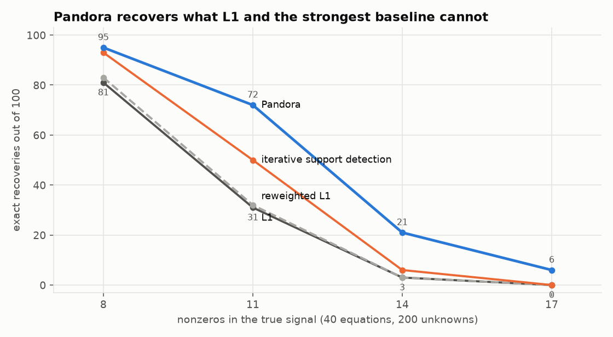
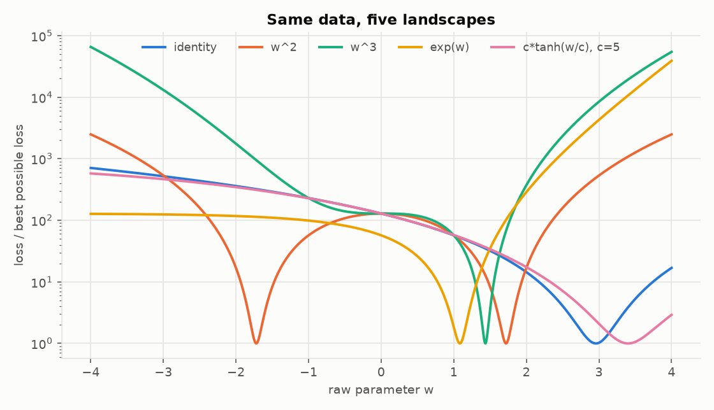
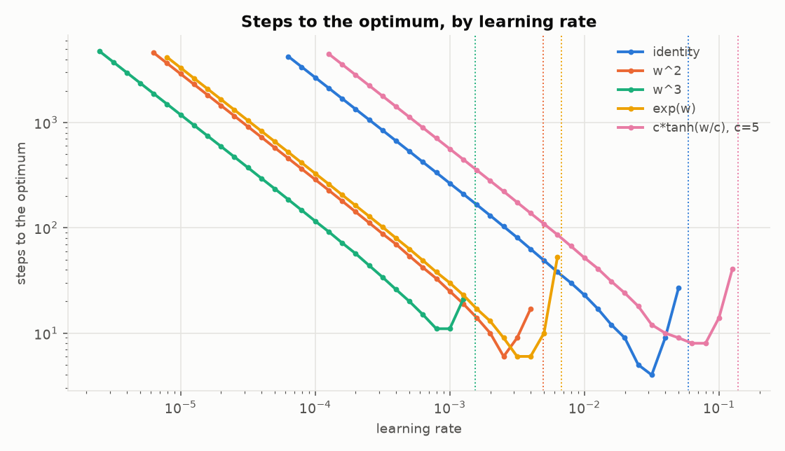
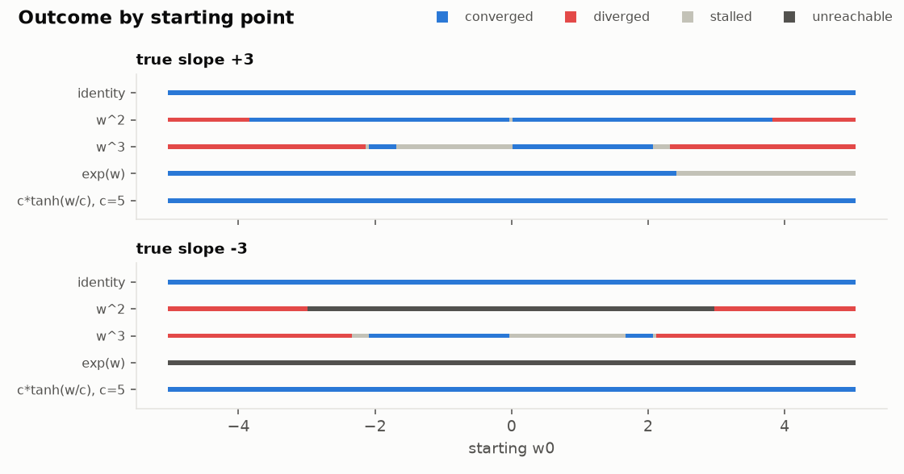
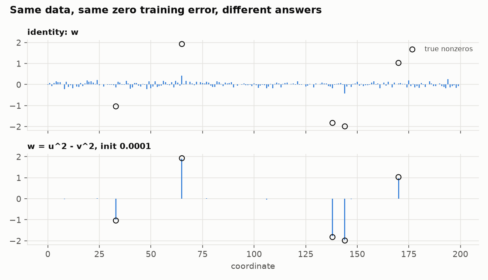
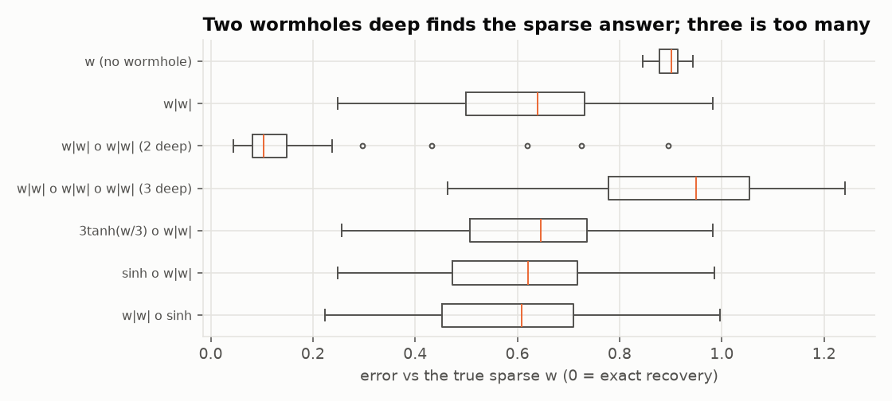
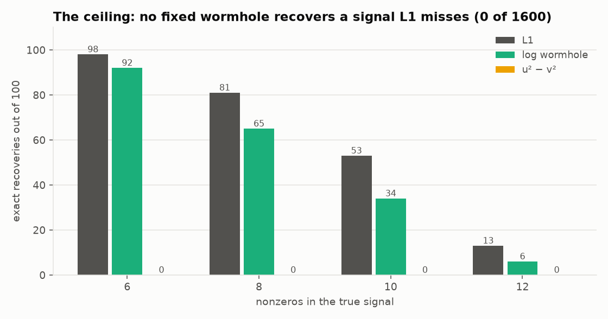
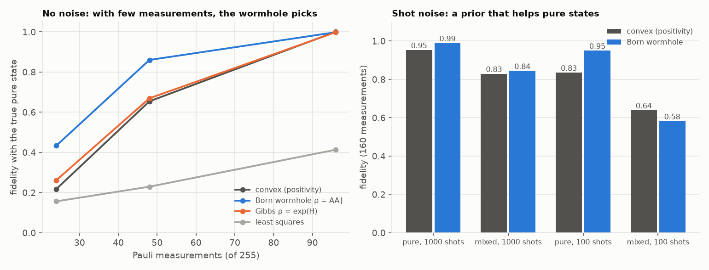
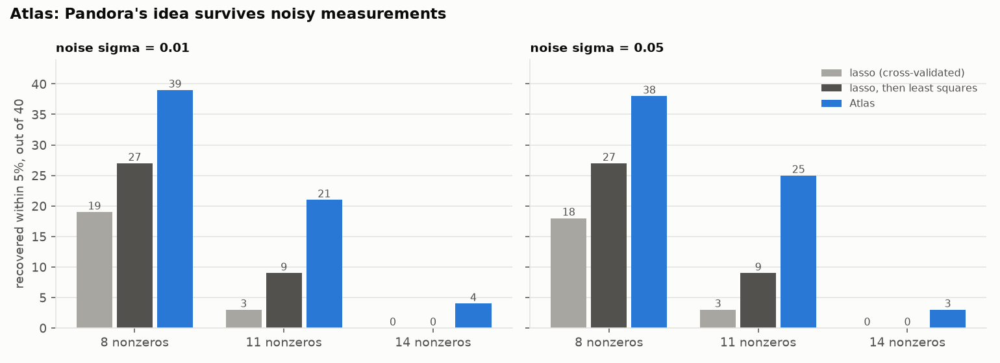

# charon

### What a parameter transform does to gradient descent.

[](https://github.com/EgorKhaklin/charon/actions/workflows/tests.yml)
[](LICENSE)

In myth, Charon ferries things to the other side. Here the parameter makes the crossing.
The optimizer moves `w`, but the model sees `T(w)`:

```
ordinary:   w ───────────▶ y_hat = w·x + b      ──▶ loss      dL/dw = mean(err·x)
charon:     w ──▶ T(w) ──▶ y_hat = T(w)·x + b   ──▶ loss      dL/dw = mean(err·x)·T'(w)
```

The idea started from E = mc². Can a physics-inspired map from the parameter you train to the
weight the model uses change how learning goes? This repository asks that question
of linear regression and checks every answer it gives.

## At a glance

Below, a **wormhole** is any reparameterization `T`: the optimizer moves `w`, the model uses `T(w)`.

- A wormhole is a learning rate that depends on position, plus a range (E1 to E8).
- When many answers fit the data, the wormhole picks which one you get. It is the minimizer of
  a convex penalty fixed by the shape of `T`, and [THEORY.md](THEORY.md) computes it without
  training (E11).
- That sets a ceiling. At finding sparse answers, such a wormhole can at best tie L1
  minimization (E12).
- **Pandora** ([its own repo](https://github.com/EgorKhaklin/pandora)) gets past the ceiling with
  many small randomized solves and a self-checking exact fit. At 11 nonzeros it recovers 72 of 100 signals, where the strongest baseline tested gets
  50 and L1 gets 31 (E17). Its noisy version, Atlas, holds up under measurement noise (E18).
- In quantum state tomography, the wormhole `ρ = AA†` prefers purer states, which no convex,
  basis-independent penalty can do (E13, E14).



## The answer, in one line

**A transform changes the route the optimizer takes. It never changes where the route ends.**
To first order, one gradient step on `w` moves the effective weight `v = T(w)` by

```
Δv ≈ −lr · T'(w)² · dL/dv
```

So every transform is a learning rate that depends on position, `lr·T'(w)²`. The only other
thing it adds is a range: `w²` and `exp(w)` can't go negative, and `c·tanh(w/c)` can't
reach `c`. A test checks this identity for every transform (`test_one_step_is_preconditioned_gd_on_v`).

And E = mc² itself? As a transform, `T(w) = c²·w` is plain linear regression with the learning
rate multiplied by `c⁴ ≈ 8×10³³`. It only converges for `lr < 7×10⁻³⁶` (E5). The constant
carries no information. The shape of `T` is what matters.

When many answers fit, the route does pick the destination, and [THEORY.md](THEORY.md) says
exactly which one. It is the fit that minimizes `Σ φ(w_i)` with `φ'' = 1/T'(T⁻¹(w))²`, a
convex penalty fixed by the transform's shape. The same note proves that such a transform,
started from zero, can at best tie L1 minimization at finding sparse answers, uniformly over
their sizes (E11, E12).

## The transforms

| T(w) | T'(w) | what it does |
|---|---|---|
| `w` | 1 | ordinary regression, the baseline |
| `w²` | 2w | range [0, ∞). Two mirror minima, and a dead point at w = 0 where training never starts |
| `w³` | 3w² | full range, but T'(0) = 0, so steps shrink to nothing near zero and blow up far away |
| `exp(w)` | exp(w) | range (0, ∞). Multiplicative updates, the same family as exponentiated gradient |
| `c·tanh(w/c)` | sech²(w/c) | special relativity's rapidity: velocity = c·tanh(rapidity). A speed limit, \|T(w)\| < c |

## What the experiments found

Data: `y = 3x + 2 + N(0, 2²)`, 100 points on [−10, 10]. Least squares gives slope 2.958 and loss 1.1645.
Every number below comes from `python -m charon.experiments` (full output in
[results/run.txt](results/run.txt)).

**E1. Same data, five different landscapes.** Ordinary regression has one bowl. `w²` has two
minima and a saddle point. `w³` and `exp` squeeze the minimum into a narrow valley. The
rapidity transform stretches it out.



**E2. Tune the learning rate for each transform before you compare them.** The original sketch
gave every model `lr = 0.01`. At that rate `w²`, `w³` and `exp` blow up near the answer, so a
shared learning rate only shows which models it happens to suit. The curvature at the optimum
is `T'(w*)²·E[x²]`, so the largest stable rate is `2 / (T'(w*)²·E[x²])`. That prediction
matches the measurements:

| transform | best lr | steps at best lr | predicted max lr | largest lr that converged |
|---|---|---|---|---|
| identity | 0.032 | 4 | 0.0588 | 0.0501 |
| w² | 0.0025 | 6 | 0.00497 | 0.00398 |
| w³ | 0.00079 | 11 | 0.00154 | 0.00126 |
| exp(w) | 0.0032 | 6 | 0.00672 | 0.00631 |
| c·tanh(w/c), c=5 | 0.063 | 8 | 0.139 | 0.126 |

Ordinary regression wins this one, and nothing can beat it. Its loss is an exact quadratic,
so with `lr = 1/E[x²]` it lands on the answer in a single step (tested). Every other transform
bends that bowl.



**E3. Where training starts decides whether it works.** 201 starting points from −5 to 5, each
transform at its best learning rate. The flipped run uses the true slope −3:

| true slope | transform | converged | diverged | stalled | can't reach it |
|---|---|---|---|---|---|
| +2.96 | identity | 201 | 0 | 0 | 0 |
| +2.96 | w² | 152 | 48 | 1 | 0 |
| +2.96 | w³ | 49 | 112 | 40 | 0 |
| +2.96 | exp(w) | 149 | 0 | 52 | 0 |
| +2.96 | c·tanh(w/c) | 201 | 0 | 0 | 0 |
| −2.96 | w² | 0 | 82 | 0 | 119 |
| −2.96 | exp(w) | 0 | 0 | 0 | 201 |

The curvature changes from place to place, so one learning rate can't work from every start.
`w³` diverges from far away and stalls near zero. `exp` stalls from negative starts,
where exp(w) is tiny. `w²` never moves from exactly zero. The rapidity transform keeps
`T'(w) ≤ 1`, so its effective step `lr·T'(w)²` never exceeds the learning rate. It is the one
transform here as robust as ordinary regression.



**E4. Noise can't tell the transforms apart.** At noise levels from 0.1 to 10, every
transform reaches the least-squares loss to within float precision. Noise changes the answer, and
every transform finds the same changed answer. Raw final loss mostly measures the noise, so
the table reports the excess over least squares instead.

**E6. Where a transform does change the answer.** With more unknowns than equations,
many weights fit the data exactly, and the route decides which one you get. Take 40
equations, 200 unknowns and a true weight with 5 nonzeros. Plain gradient descent from zero
lands on the minimum-norm fit, which is spread out and wrong. Writing `w = u² − v²` and
starting small lands on the sparse truth:

| parameterization | steps to fit (residual 1e-8) | error vs true w | true nonzeros found |
|---|---|---|---|
| `w` | 500 | 0.913 | 2/5 |
| `u² − v²`, init 0.1 | 5,000 | 0.649 | 3/5 |
| `u² − v²`, init 0.01 | 36,000 | 0.288 | 5/5 |
| `u² − v²`, init 0.0001 | over 400,000 (residual 4e-6) | 0.028 | 5/5 |

The smaller the starting size, the sparser the answer and the slower the training. The
smallest start costs about 1000x the steps of plain descent, and its last digits of fit arrive
very slowly, because the coordinates still carrying the residual are tiny and so are their
steps. Even this run is not exactly sparse: a few wrong coordinates reach about 0.03. Here the
minimum-L1 fit equals the true weight exactly (checked once with a linear program), and the
squared parameterization only approaches it as the start shrinks toward zero (a start of 1e-8
gave error 0.004 in a side run). This is the known implicit bias of a squared
reparameterization. It is the setting where the "wormhole" idea has real work to do.



**E7. Adam instead of gradient descent.** Adam divides each step by a running average of the
gradient's size. That removes part of what a transform does, but not all of it:

| transform | best lr | steps at best lr | lr that converged | starts converged, GD | starts converged, Adam |
|---|---|---|---|---|---|
| identity | 2.5 | 44 | 0.0016 to >= 10 | 201/201 | 160/201 |
| w² | 0.63 | 92 | 0.0005 to >= 10 | 152/201 | 149/201 |
| w³ | 0.16 | 81 | 0.00032 to 3.16 | 49/201 | 145/201 |
| exp(w) | 0.2 | 40 | 0.00025 to 2 | 149/201 | 176/201 |
| c·tanh(w/c), c=5 | 0.79 | 23 | 0.002 to 5.01 | 201/201 | 186/201 |

Each step in `w` now has a bounded size, so blow-ups mostly disappear. Adam rescues `w³` from
far starts (145 of 201, up from 49). But it is slower at its best than tuned gradient descent
(23 to 92 steps, against 4 to 11), and identity and rapidity lose some starts they never lost
under gradient descent. Under Adam, `v` moves by about `lr·|T'(w)|` per step instead of
`lr·T'(w)²`. For E = mc², this means `T(w) = c²·w` under Adam is identity at `lr·c²`, not
`lr·c⁴` (tested exactly). With the real c it converges at every learning rate from 1e-4 to
10, where gradient descent needed `lr < 7×10⁻³⁶`. Adam cancels the c² in the gradient. It
can't cancel the c² in the parameter.

**E8. Several features on different scales.** One coordinate per feature, three features on
scales 1, 10 and 100 (condition number about 10⁴). Each cell is the fewest steps to the optimum
over 91 learning rates, within a 20,000-step budget:

| true weights | identity | w / sd(x_i) | w² | w³ | exp(w) | c·tanh(w/c) |
|---|---|---|---|---|---|---|
| big weight on the small feature (3, 2, 0.5) | none | 4 | 8843 | 7580 | 3180 | none |
| big weight on the big feature (0.5, 2, 3) | 17714 | 6 | none | none | none | 715 |
| equal contributions (3, 0.3, 0.03) | none | 5 | 2217 | 601 | 5944 | none |

A fixed linear rescale by each feature's spread, `T_i(w) = w / sd(x_i)`, takes 4 to 6 steps
in every case. That is just standardizing the inputs, and it fixes the conditioning outright. The
nonlinear transforms scale each step by the weight's own size (`w²` by 4|v|, `exp` by v²). They
win when the large-scale features carry small weights, and lose badly when they don't. A
transform helps only when its `T'(w)²` happens to track the inverse curvature. The data decide
the curvature. The transform doesn't know the data.

## Wormholes within wormholes

`python -m charon.frontier` (about 10 minutes; output in [results/frontier.txt](results/frontier.txt))
pushes the idea further on E6's sparse problem. The code is in
[charon/wormholes.py](charon/wormholes.py).

**E9. Nesting.** A wormhole inside a wormhole is the composed transform
`T(w) = outer(inner(w))`. By the chain rule its step factor is the product
`outer'(inner(w))² · inner'(w)²`, so nesting multiplies preconditioners. Nesting `w|w|`
k times gives the signed power `p = 2^k`, whose step in terms of the effective weight is
`lr · p² · |v|^(2 − 2/p)`. Each level makes small weights slower and big weights relatively
faster. Every run takes its step as a fraction of its own stability limit, so a transform is
judged on the answer it finds, not on surviving one shared learning rate. 40 test problems,
with learning rate and starting size picked on 8 other problems:

| transform | median error vs true w | median residual after 6000 steps |
|---|---|---|
| `w` (no wormhole) | 0.901 | 2e-17 |
| `w|w|` | 0.639 | 3e-04 |
| `w|w| ∘ w|w|` (2 deep) | **0.104** | 2e-02 |
| `w|w| ∘ w|w| ∘ w|w|` (3 deep) | 0.950 | 6e-01 |
| `3·tanh(w/3) ∘ w|w|` | 0.645 | 7e-05 |
| `sinh ∘ w|w|` | 0.621 | 5e-03 |
| `w|w| ∘ sinh` | 0.609 | 6e-03 |

Two levels deep finds the sparse answer six times more accurately than one level, but its
last digits of fit come slowly (residual 2e-2 after 6000 steps). Three levels is too many.
The steps near zero shrink so hard that nothing grows, and the run never fits the data.
Wrapping `w|w|` in a bounded or exponential wormhole changes nothing measurable. The
improvement from depth matches what is known for deep diagonal linear networks
(Woodworth et al. 2020). The failure at depth 3 is the finite-step cost that theory leaves
out.



**E10. Wormhole jumps (falsified).** For `w = u² − v²`, gradient descent conserves `u·v` in
every coordinate, and a small `u·v` is what makes the answer sparse. A jump resets `u·v` to
a tiny value while keeping `u² − v²` exactly, so the model's function doesn't change. The hope
was to get the sparse answer of a tiny start without its slow plateau. It doesn't work:
jumping every 200 steps from a start of 0.1 lands within 0.03 of the plain 0.1 run on all 3
problems (error 0.40 to 0.65, against 0.002 to 0.03 for a true tiny start). The dense fit
forms in the first few hundred steps, and a jump that keeps the function also keeps that fit.

**E11. The destination without the route.** For a wormhole that stays fixed during training,
the place gradient descent ends is fixed in advance. It is the fit that minimizes
`Σ φ(w_i)`, where `φ'' = 1/m` ([THEORY.md](THEORY.md), Theorem 1).
[charon/destination.py](charon/destination.py) computes that point by solving 40 equations,
with no training. Gradient descent then lands on it, up to an error proportional to the step
size:

| wormhole | predicted error vs true w | GD vs prediction, lr 0.25 | GD vs prediction, lr 0.025 |
|---|---|---|---|
| `u² − v²` metric, a = 0.01 (3 problems) | 0.32 to 0.59 | 2.4e-2 to 2.9e-2 | 2.6e-3 to 3.1e-3 |
| log wormhole from styx (3 problems) | 0.0000 | 3e-5 to 1.5e-4 | 3e-5 to 1.3e-4 |

This is charon's one-line answer made exact. The route belongs to `m`. The destination
belongs to `φ`, and scaling `m` by any constant doesn't move it.

**E12. The ceiling.** Theorem 2 in [THEORY.md](THEORY.md) shows that a fixed elementwise
wormhole started at zero cannot beat L1 minimization uniformly. If it recovers a sparse vector
with equal-size nonzeros, L1 recovers every vector with that support and those signs. The proof
needs only that `φ'` never decreases, which holds because `m > 0`. Checked on 800 problems
(6 to 12 nonzeros; sizes all equal, or uniform between 1 and 2), with each wormhole's destination
computed exactly:

| nonzeros | L1 exact | log wormhole exact | `u² − v²` (a = 0.001) exact | recovered by a wormhole but not by L1 |
|---|---|---|---|---|
| 6 | 98 / 100 | 91 to 92 | 0 | 0 |
| 8 | 81 | 65 to 67 | 0 | 0 |
| 10 | 53 | 34 to 35 | 0 | 0 |
| 12 | 13 | 6 | 0 | 0 |



In 1,600 wormhole runs, no wormhole ever recovered a vector L1 missed. L1's counts are the
same whether the nonzeros are equal or random in size, because whether L1 succeeds depends only
on the support and signs. `u² − v²` at a = 0.001 is never exact, as the theory's proposition
predicts: with `m(0) > 0` a wormhole only approaches sparsity. The theory also names the ways
out: a metric that changes during training, coupled coordinates, a start away from zero,
large noisy steps, or a nonlinear model.

## Quantum wormholes

Everything above commutes: each coordinate has its own wormhole. In quantum mechanics the
unknown is a density matrix `ρ`, and a wormhole is a matrix map. The task is quantum state
tomography. 4 qubits, an unknown state, and only `m` of its 255 Pauli expectation values
measured. `ρ = AA†` (Born) is the matrix version of `u²`. `ρ = exp(H)/tr` (Gibbs) is mirror
descent with the von Neumann entropy. Code in [charon/quantum.py](charon/quantum.py), output in
[results/quantum.txt](results/quantum.txt).

**E13. With too few measurements, the wormhole picks the state.** Every estimator fits the
data exactly. Fidelity with the true pure state, 10 states per row:

| measurements | least squares | positivity (convex) | Born, start 0.001 | Born, start 1 | Gibbs (max entropy) |
|---|---|---|---|---|---|
| 24 | 0.156 | 0.217 | **0.433** | 0.262 | 0.261 |
| 48 | 0.229 | 0.654 | **0.860** | 0.681 | 0.669 |
| 96 | 0.413 | 1.000 | 0.998 | 0.993 | 0.998 |

At 96 measurements positivity alone pins the state, and every positive estimator finds it.
This is known (Kalev, Kosut and Deutsch, 2015). Below that, the Born wormhole from a small
start lands closest to the truth, by a factor of 2 at 24 measurements. Its estimates are purer
(purity 0.78 against 0.57 at 48). THEORY.md, Theorem 3, says why no convex method can do this.
Any convex penalty that ignores the basis prefers the maximally mixed state. A pull toward
purity has to come from the non-commuting dynamics of `AA†`.



**E14. With shot noise, the pull toward purity is a prior.** Each Pauli is measured 100 or 1000
times. Model selection uses 20% of the measurements held out, never the truth. 8 states per row:

| true state | shots | measurements | positivity (convex) | rank 1 of convex (told it is pure) | Born wormhole |
|---|---|---|---|---|---|
| pure | 100 | 96 | 0.765 | 0.951 | **0.876** |
| pure | 100 | 160 | 0.835 | 0.972 | **0.950** |
| pure | 1000 | 160 | 0.953 | 0.997 | **0.989** |
| rank 4 | 100 | 96 | **0.469** | 0.265 | 0.388 |
| rank 4 | 100 | 160 | **0.639** | 0.331 | 0.582 |
| rank 4 | 1000 | 160 | 0.829 | 0.401 | **0.844** |

On pure states the Born wormhole beats the convex estimator in every cell, without being
told the rank. Telling an estimator the state is pure does better still. On mixed states that
told-pure estimator collapses (0.27 to 0.40). The wormhole bends instead of breaking. It loses
to the convex estimator under heavy noise and edges ahead at 1000 shots. Projected least
squares trails both everywhere. The wormhole's bias is an estimation principle, a soft
preference for purity, and like any prior it costs something when it is wrong.

## E15. Schedules past the ceiling

Theorem 2's assumptions are the ways past the ceiling: a metric that changes with time,
coordinates that interact, a start away from zero. Each schedule below takes one of those routes.
Sparse recovery as in E12, 60 test problems, settings picked on 12 others ([results/schedules.txt](results/schedules.txt)):

| schedule | route | exact at 8 nonzeros | exact at 11 | beyond L1 |
|---|---|---|---|---|
| L1 minimization | (reference) | 53/60 | 18/60 | |
| log wormhole, fixed | none | 39 | 7 | 0 |
| **Lethe**: the floor (what lets weights leave zero) fades during training | time | 15 | 1 | 0 |
| **Sisyphus**: `τ` rolls up and back down three times | time | 20 | 3 | 0 |
| **Eris**: each weight's speed set by its size relative to the largest | coupling | 0 | 0 | 0 |
| **Orpheus**: a sharper wormhole started from where the first ended | start | **41** | **8** | 0 |

Only Orpheus improves on the fixed wormhole, and none recovers a single vector L1 misses.
With 40 equations, an exhaustive search would recover any signal with up to 19 nonzeros, so the
room above L1 is large. The routes the theory opens are real; no schedule tried here finds them.

**E16. Obol: counting the support.** L1 never asks how many nonzeros there are.
Counting them works like this. Rank the coordinates, then take the smallest `s` whose top `s`
fit the equations exactly. With 40 equations, an exact fit on fewer than 20 coordinates is
generically unique, so a hit certifies itself. Cerberus runs the wormhole, counts, marks the top
39 coordinates (only marked ones may move) and restarts, three times, each round six times
sharper ([results/counting.txt](results/counting.txt)):

| nonzeros | L1 | L1 ranking, then count | wormhole ranking, then count (Obol) | Cerberus (three rounds) |
|---|---|---|---|---|
| 8 | 53/60 | 53 | 50 | 52 |
| 11 | 18 | 18 | 17 | 18 |
| 14 | 1 | 1 | 1 | 1 |
| 17, 19 | 0 | 0 | 0 | 0 |

Obol lifts the wormhole from 39 to 50, and Cerberus to 52, nearly level with L1. Neither
never goes past L1: when L1 fails, the true support isn't among the top-ranked coordinates of
any of these rankings, so there is nothing to count. Beyond L1, the problem is the ranking.

## E17. Pandora: past the ceiling

Pandora now has its own repository, with a phase diagram and four matrix ensembles:
**[EgorKhaklin/pandora](https://github.com/EgorKhaklin/pandora)**. The numbers below are the
original experiment.

E16's lesson was that past L1, the problem is the ranking. **Pandora** opens many small
vessels. Each is basis pursuit on 60 columns: the 20 best-scored so far and 40 at random.
Small vessels are easy problems, and each one adds its answer to the scores. Every 5 vessels,
least squares on the 39 best-scored columns tries to fit all 40 equations exactly. A hit is
self-certifying ([THEORY.md](THEORY.md)): the true support is inside, and least squares
returns the true signal. [charon/pandora.py](charon/pandora.py), 100 new problems per row,
up to 200 vessels ([results/pandora.txt](results/pandora.txt)):

| nonzeros | L1 | reweighted L1 | iterative support detection | **Pandora** | solved only by Pandora / only by ISD |
|---|---|---|---|---|---|
| 8 | 81 | 83 | 93 | **95** | 2 / 0 |
| 11 | 31 | 32 | 50 | **72** | 25 / 3 |
| 14 | 3 | 3 | 6 | **21** | 16 / 1 |
| 17 | 0 | 0 | 0 | **6** | 6 / 0 |


Iterative support detection (Wang and Yin, 2010) is the strongest baseline here, the published
method known to beat L1 in this setting. Pandora recovers more at every sparsity level, and the
gap widens as the problems get harder: 72 against 50 at 11 nonzeros, 21 against 6 at 14. On the
same problems it misses only 4 that ISD solves. Its relatives are Random Lasso (2011) and
stability selection (2010). The recipe of small biased vessels plus an exact-fit stopping
certificate was not found in a literature search, and no randomized ensemble was found
reported to beat the L1 transition. One limit: Pandora costs up to 200 linear programs per
problem where L1 costs 1. More vessels do not help past about a hundred. In a side run at 14
nonzeros, budgets of 111, 240, 418, and 444 vessels all certified the same 11 of 60.

Side runs (not in the script, 60 problems each):

- **Hesperides**, ten vessel-solvers on a fixed 22-edge graph, mixing vessel sizes, is about as
  good as Pandora and never better (39 against 42 at 11 nonzeros, 11 against 13 at 14).
- **Plato**, a measurement design with half the coherence (0.32 against 0.61), helps L1 at 11
  nonzeros (28 against 20). It hurts every method at 14 (L1 4 to 0, Pandora 16 to 14).

## E18. Atlas: Pandora under noise

Real measurements are noisy, and an exact fit no longer exists. **Atlas** keeps Pandora's
vessels, solved by lasso instead of basis pursuit. It takes the smallest top-ranked support
whose least-squares residual has fallen to the noise floor. 40 problems per row; "within 5%"
means relative error below 0.05 ([results/atlas.txt](results/atlas.txt)):

| noise | nonzeros | lasso (cross-validated) | lasso, then least squares on its support | **Atlas** |
|---|---|---|---|---|
| 0.01 | 8 | 19/40 | 27/40 | **39/40** |
| 0.01 | 11 | 3/40 | 9/40 | **21/40** |
| 0.01 | 14 | 0/40 | 0/40 | **4/40** |
| 0.05 | 8 | 18/40 | 27/40 | **38/40** |
| 0.05 | 11 | 3/40 | 9/40 | **25/40** |
| 0.05 | 14 | 0/40 | 0/40 | **3/40** |



The noise-floor test needs the noise level, which this experiment gives it. In practice that
level has to be estimated.

Learning the wormhole instead of picking it worked better. That experiment needs torch and
lives in [styx](https://github.com/EgorKhaklin/styx).

## So which of the four outcomes?

The original sketch listed four possible conclusions. For one-dimensional linear regression
the answer is **3 and 4**. The transform changes optimization but brings no overall
advantage, and it behaves exactly like known techniques: a preconditioner, a positivity
constraint (`exp`), a bounded weight (`tanh`), a squared factorization (`w²`).

Two cases stretch this, and both have known names. With many exact fits (E6), the transform
picks which one you get, so outcome 1 holds for the answer but not the speed. With badly scaled
features (E8), a transform speeds things up exactly when `T'(w)²` matches the inverse curvature.
The one that always does is a fixed rescale by the feature's spread, which is input
standardization. Adam (E7) removes the gradient-scale half of a transform's effect and leaves
the parameter-scale half.

Related work, for anyone going further: natural gradient (Amari, 1998) for transforms viewed as
preconditioning; exponentiated gradient (Kivinen and Warmuth, 1997) for `exp`; weight
normalization (Salimans and Kingma, 2016) for reparameterization in deep networks; and
Woodworth et al., "Kernel and Rich Regimes in Overparametrized Models" (COLT 2020), for E6.

## Run it

```bash
python -m venv .venv && .venv/bin/pip install -e '.[test]'
.venv/bin/python -m pytest -q              # 64 tests
.venv/bin/python -m charon.experiments     # ~22 s; writes figures/ and results/
.venv/bin/python -m charon.frontier        # ~35 min; E9 to E18 (or name some: e17 e18)
.venv/bin/python -m charon.figures         # redraws the comparison figures from results/
```

To add a transform, define `T`, `dT` and `inverse` in [charon/transforms.py](charon/transforms.py)
and add it to `DEFAULT`. The gradient test (a finite-difference check) and the preconditioning
test cover it automatically.

## Limits

Everything here is synthetic and small. E1 to E8 are one-dimensional regression. The sparse
problems are random Gaussian systems of 40 equations in 200 unknowns, and the quantum
experiments use 4 qubits. Pandora's gains are measured on that one problem family with 40 to 100
problems per cell, against the baselines named in each table. Nothing here is a claim about
real data or large models. Learning rates come from grids, not an optimizer. THEORY.md's
results are proved under the assumptions it states (gradient flow, a fixed elementwise metric,
a start at zero, Gaussian matrices for the certificate).

## License

MIT
